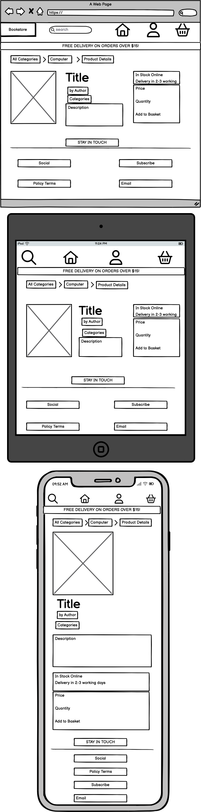
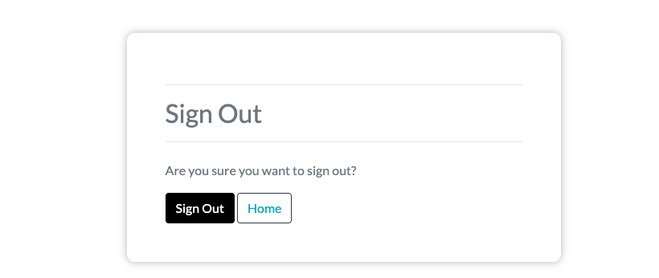

# eCommerce: Online Bookstore

**Developer: Bin Ma**

💻 [Visit live website](https://online-bookstore-13cd2c9ddb0f.herokuapp.com/)  
(Ctrl + click to open in new tab)

## Table of Contents
  - [Business Plan ](#business-plan)
     - [Executive Summary](#executive-summary)
     - [Business Description](#business-description)
     - [Market Analysis](#market-analysis)
     - [Marketing and Sales Strategy](#marketing-and-sales-strategy)
     - [Product and Service Line](#product-and-service-line)
     - [Operations and Management](#operations-and-management)
     - [Financial Projections](#financial-projections)
     - [Funding and Investment](#funding-and-investment)
     - [SWOT Analysis](#swot-analysis)
     - [Risk and Mitigation](#risk-and-mitigation)
     - [Legal and Regulatory Considerations](#legal-and-regulatory-considerations)
     - [Timeline and Milestones](#timeline-and-milestones)
     - [Conclusion](#conclusion)
  - [Marketing](#marketing)
     - [Social Media](#social-media)
     - [Mailing List](#mailing-list)
  - [User Goals](#user-goals)
  - [Site Owner Goals](#site-owner-goals)
  - [User Experience](#user-experience)
  - [User Stories](#user-stories)
  - [Wireframes](#wireframes)
  - [Design](#design)
    - [Colors](#colors)
    - [Fonts](#fonts)
    - [Structure](#structure)
      - [Website pages](#website-pages)
      - [AWS](#aws)
      - [Database](#database)
      - [Models](#models)
  - [Technologies Used](#technologies-used)
  - [Features](#features)
  - [Validation](#validation)
  - [Testing](#testing)
    - [Manual testing](#manual-testing)
    - [Automated testing](#automated-testing)
    - [Tests on various devices](#tests-on-various-devices)
    - [Browser compatibility](#browser-compatibility)
  - [Bugs](#bugs)
  - [Deployment](#deployment)
  - [Credits](#credits)
  - [Acknowledgements](#acknowledgements)

## Business Plan  
### Executive Summary:

- Our company "Online Bookstore" aims to establish an online platform catering to a diverse audience of book enthusiasts.
- Our mission is to provide an accessible platform where customers can discover, purchase, and enjoy a wide range of books across genres.
- With a commitment to exceptional customer service and personalized recommendations, we aspire to become a leading online destination for book lovers.

### Business Description:

- Online Bookstore is an innovative online bookstore that combines convenience, curation, and large selection of books.
- Our value proposition lies in offering a carefully curated collection of books and a user-friendly interface.
- By fostering a love for reading and creating an immersive online experience, we aim to redefine the way customers shop for books.

### Market Analysis:

- Our target market includes book enthusiasts of all ages, comprising kids, students, professionals, and leisure readers.
- The online book sales industry is on an upward trajectory, driven by the growing preference for e-books and the convenience of online shopping.
- While facing competition from established online bookstores, our store differentiates itself through its curated selection and personalized customer engagement.

### Marketing and Sales Strategy:

- Our store will leverage the power of online marketing through social media platforms such as Facebook, Instagram, and Twitter. Currently, we have opened the Facebook business page and will have more on the social media.
- Our content marketing strategy includes regular blog posts featuring book reviews, author interviews, and details. 
- To enhance our online visibility, we will implement a robust SEO strategy, optimizing website content for relevant keywords.
- Email marketing will play a pivotal role, with monthly newsletters offering exclusive discounts, new releases, and personalized book suggestions.
- Our sales funnel will guide visitors from engaging content to newsletter subscription, ultimately converting them into loyal customers.

### Product and Service Line:

- Our store's extensive product line encompasses various genres including Computer, Fiction, Children's, Art, Teen, and more.
- We offer special features such as signed copies, limited edition releases, and curated book bundles, enhancing the uniqueness of our offerings.

### Operations and Management:

- Online Bookstore's user-friendly website will streamline the online shopping experience, allowing customers to easily browse, search, and purchase books.
- Our technological foundation will be built on a robust and secure platform, ensuring seamless transactions and protecting customer information.
- The founding team comprises a CEO responsible for strategic direction and marketing, a Web Developer overseeing the technical aspects, and a dedicated Customer Support Representative.

### Financial Projections:

- Online Bookstore's sales forecast anticipates revenues of €150,000 in the first year, €300,000 in the second year, and €500,000 in the third year.
- Estimated costs include website development (€10,000), marketing expenses (€20,000), inventory acquisition (€40,000), packaging and shipping (€30,000), and operational costs (€15,000 annually).
- Profitability projections indicate net profits of €40,000 in Year 1, €100,000 in Year 2, and €180,000 in Year 3.

### Funding and Investment:

- Online Bookstore seeks an initial investment of €100,000, comprising personal savings and a small business loan, to cover startup and operational expenses.

###  SWOT Analysis:

- Our strengths lie in our curated collection and user-friendly platform.
- Addressing weaknesses related to brand recognition and early-stage operations is a priority.
- Capitalizing on opportunities within the growing e-book market and potential author collaborations will drive growth.
- Mitigating threats such as intense competition necessitates continuous innovation and customer engagement.

### Risk and Mitigation:

- Risk: Supply chain disruptions impacting book availability, especially during the probable recession stage.
- Mitigation: Establishing partnerships with multiple book distributors to ensure a diversified inventory.

### Legal and Regulatory Considerations:

- Compliance with copyright laws and licensing agreements for book sales.
- Adherence to data privacy regulations to protect user information.

### Timeline and Milestones:

- Months 1-2: Develop and test the website's functionality.
- Months 3-4: Create engaging content and initiate social media outreach.
- Months 5-6: Soft launch, gather user feedback, and make improvements.
- Months 7-8: Full-scale launch, execute targeted marketing campaigns, and focus on customer acquisition.

### Conclusion:

- Online Bookstore's comprehensive business plan underscores our commitment to offering an innovative and personalized online bookstore experience.
- With a curated collection, intuitive user interface, and a community-driven approach, we anticipate growth and success in the competitive digital book market.
- By combining technological expertise with a passion for literature, our store aims to enrich readers' lives and inspire a lifelong love of reading.

## Marketing  

### Social Media  
The web app "Online Bookstore" has a presence on Facebook. The Facebook page serves as a platform to promote upcoming events, post updates on the latest features, and share user-generated content. The social media account allows users to stay informed and connected with the "Online Bookstore" community.

[Facebook](https://www.facebook.com/profile.php?id=61550090936485)  
(Ctrl + click to open in new tab)

See Image

### Mailing List  

The Online Bookstore employs Mailchimp as its mailing list management tool. When users become part of the mailing list, they will be kept informed about new functionalities, upcoming events, and exclusive promotions. The procedure for joining the mailing list is straightforward – users only need to input their email addresses on the website. Subsequently, they will begin to receive email updates. With Mailchimp, the "Online Bookstore" team can segment the mailing list, personalize emails, and monitor the efficacy of email campaigns. By becoming a part of the mailing list, users will remain well-informed and will be at the forefront of new advancements in the "Online Bookstore" web app.  

See Image

  

 

## User Goals

- Browse and discover a wide range of books across various genres and topics.
- Easily search for specific books using filters such as author, genre, or release date.
- Access detailed book information, including summaries and author's information.
- Track and manage orders, including order history and delivery status.
- Stay informed about new book releases, author events, and literary news through newsletters and our Facebook business community.

## Site Owner Goals

- Generate Revenue: Drive sales and revenue through book purchases and related merchandise.
- Expand Customer Base: Attract and retain a growing customer base of book enthusiasts.
- Build Brand Loyalty: Cultivate brand loyalty by offering high-quality books and excellent customer service.
- Curate Quality Content: Offer a diverse and well-curated selection of books across genres.
- Implement Marketing Strategies: Utilize marketing strategies to promote special offers, discounts, and new releases.
- Optimize Inventory Management: Efficiently manage inventory to ensure availability and timely delivery.

## User Experience

### Target Audience

- Avid readers of all ages who enjoy exploring a diverse range of books across genres and topics.
- Students and educators seeking academic and reference materials for learning and research purposes.
- Gift shoppers searching for thoughtful presents for friends and family members who appreciate reading.
- Professionals seeking business and self-development books to enhance their skills and knowledge.
- Customers who value convenience and wish to shop for books online, avoiding the need to visit physical stores.

### User Requirements and Expectations

- Intuitive Browsing: Users expect a user-friendly interface that enables easy exploration of book categories and titles, facilitating efficient book discovery.
- Reliable Transactions: Users require a dependable purchasing process, ensuring smooth transactions without technical glitches or payment hiccups.
- Secure Transactions: Users anticipate robust security measures to safeguard their personal and financial information during online purchases.
- Comprehensive Book Information: Users seek detailed book descriptions and author information to make informed purchase decisions.
- Seamless Checkout Process: Users desire a streamlined checkout process, minimizing the steps required to finalize their book purchases.
- Order Tracking: Users require the ability to track their orders, with updates on shipping and delivery status.

##### Back to [top](#table-of-contents)

## User Stories

### Registration and Accounts
- As a shopper/ site user, I can register an account so that I can continue to check out the selected products./ I can have a personal account so that I can view my profile.
- As a shopper/ site user, I can login and logout the account so that I can use the stored delivery information and check the purchase history./ I can login and logout of the account so that I can access my account.
- As a shopper/ site user, I can reset the password so that I can recover my password when I forgot my password.
- As a shopper/ site user, I can receive an email verification requirement so that I can verify my account.
- As a shopper/ site user, I can use stored information so that I can make the payment faster.

### Viewing and Navigation
- As a shopper/ site user, I can use the navigation menu so that I can be linked across the website.
- As a shopper/ site user, I can use the navigation link on the footer so that I can follow the store on Facebook to check the latest offer easily.
- As a shopper/ site user, I can use the navigation link on the footer so that I can view the privacy policy.
- As a shopper/ site user, I can sign up for the email so that I can get notified when any new books are published.
- As a shopper/ site user, I can be notified by the login and logout status.
- As a shopper, I can view the basket so that I can see my shopping list and the total amount of cost at any time.
- As a shopper/ site user, I can click on the homepage so that I can view all categories of books available online.
-As a shopper/ site user, I can click the individual product so that I can view the product details.

### Search and Sort
- As a shopper/ site user, I can use the search bar so that I can search for a product by name or description.
- As a shopper/ site user, I can access to search result page so that I can see the search results.
- As a shopper/ site user, I can click the sorting button so that I can view the search results by either price or name.

### Purchase and Checkout
- As a shopper/ site user, I can add the selected product to the basket so that I can complete the payment./ I can add my favorite books to the basket so that I can know the total cost of the purchase.
- As a shopper/ site user, I can use the card to make a payment so that I can complete the purchase./ I can make a purchase by using the card after login.
- As a shopper/ site user, I can use update and remove button so that I can either adjust the quantity of the basket or delete the orders.
- As a shopper/ site user, I can view the order summary so that I can know my order list.
- As a shopper/ site user, I can get a confirmation email so that I can get a record of the purchase.

### Store management and Admin
- As a store owner/ admin, I can add new products to the store.
- As a store owner/ admin, I can update information for the existing products in the store.
- As a store owner/ admin, I can delete the products from the shop.
- As a store owner/ admin, I can check the order list from the customers so that I can make a shipment when the payment status is successful.
- As a store owner/ admin, I can add a new employee to the store.
- As a store owner/ admin, I can update the employees' information.
- As a store owner/ admin, I can delete the employee who has left their jobs.
- As a store owner/ admin, I can check the personal information of employees.

### Kanban & User Stories
- The GitHub Kanban board was employed to monitor the status of all active user stories.
- Within the Kanban board, columns titled Backlog, In Progress, and Done were employed for effective organization.

User Stories

Kanban

##### Back to [top](#table-of-contents)

## Wireframes
I utilized Balsamiq to craft wireframes for my project. This user-friendly wireframing tool empowers me to swiftly generate mockups for my website or application. It provides an extensive array of pre-designed UI elements and fosters seamless collaboration within my team. I've included an image version of my wireframes, granting you access to review the design, layout, and project flow before translating it into the actual product.

Wireframe Home
  

Wireframe Homepage
  

Wireframe Product Detail
  

Wireframe Checkout
  

Wireframe Profile
  

## Design

### Colors

The white background and black font color has been used across the websites which will give the shoppers a simple and clean feeling. And gray is used for mouse-click links.

See Color Palette

### Fonts

The font selected was from Google Fonts. "Lato" has been selected.

# Structure

- The website's layout was crafted to ensure user familiarity, featuring elements such as a navigation bar positioned at the top of each page, along with a hamburger menu button tailored for smaller screens.
- Within the footer, you'll discover an array of pertinent social media links associated with the business. Additionally, the footer houses an email sign-up form, valuable links, and contact details.

## Website pages

- The site consists of the following pages:
  - Home
  - Homepage
  - Product details
  - Basket
  - Checkout
  - Checkout Success
  - Register
  - Profile
  - Login
  - Logout
  - Reset Password
  - Register
  - Admin Management Panel
  - 404

  ##### Back to [top](#table-of-contents)
  

## AWS 

I leverage AWS S3 buckets for data storage purposes. S3 stands as a remarkably scalable and resilient cloud storage solution offered by Amazon Web Services. This service grants me seamless storage and retrieval capabilities for substantial data volumes, enhanced further by its integrated security measures that bolster the safeguarding of my files. My preference for S3 is rooted in its exceptional scalability, robust durability, and comprehensive security attributes.

## Database

I constructed my database utilizing PostgreSQL, a potent and open-source object-relational database system recognized for its unwavering dependability, resilience, and exceptional performance. I opted for PostgreSQL due to its versatility, offering an efficient tool for adeptly administering and structuring my data.

## Models  

### Employee Model

| Key        | Name           | Type        |
| ---------- | ------------   | ----------- |
| PrimaryKey | employee_id    | AutoField   |
|            | name           | CharField   |
|            | age            | IntegerField|
|            | create_time    | DateField   |
|            | depart         | CharField   |
|            | mobile_number  | CharField   |
|            | street_address1| CharField   |
|            | address2       | CharField   |
|            | city           | CharField   |
|            | county         | CharField   |
|            | gender         | SmallIntegerField|

### User Model

| Key        | Name         | Type        |
| ---------- | ------------ | ----------- |
| PrimaryKey | user_id      | AutoField   |
|            | password     | VARCHAR     |
|            | last_login   | VARCHAR     |
|            | is_superuser | BOOLEAN     |
|            | username     | VARCHAR     |
|            | first_name   | VARCHAR     |
|            | last_name    | VARCHAR     |
|            | email        | VARCHAR     |
|            | is_active    | BOOLEAN     |
|            | date_joined  | VARCHAR     |

### User Profile Model

| Key        | Name                        | Type          |
| ---------- | --------------------------- | ------------- |
| PrimaryKey | user_profile_id             | AutoField     |
| ForeignKey | user                        | User model    |
|            | default_mobile_number       | CharField     |
|            | default_street_address1     | CharField     |
|            | default_street_address2     | CharField     |
|            | default_city                | CharField     |
|            | default_county              | CharField     |
|            | default_postcode            | CharField     |
|            | default_country             | CharField     |

### Product Model

| Key        | Name        | Type           |
| ---------- | ----------- | -------------- |
| PrimaryKey | pid         | AutoField      |
|            | name        | CharField      |
|            | author      | CharField      |
|            | description | TextField      |
|            | price       | DecimalField   |
| ForeignKey | category    | Category model |
|            | image       | ImageField     |

### Category Model  

| Key        | Name          | Type      |
| ---------- | ------------- | --------- |
| PrimaryKey | cid           | AutoField |
|            | name          | CharField |
|            | friendly_name | CharField |

### Order Model  

| Key        | Name            | Type               |
| ---------- | --------------- | ------------------ |
| PrimaryKey | order_id        | AutoField          |
|            | order_number    | CharField          |
| ForeignKey | user_profile    | User profile Model |
|            | full_name       | CharField          |
|            | email_address   | EmailField         |
|            | mobile_number   | CharField          |
|            | street_address1 | CharField          |
|            | street_address2 | CharField          |
|            | city            | CharField          |
|            | postcode        | CharField          |
|            | county          | CharField          |
|            | country         | CharField          |
|            | date            | DateTimeField      |
|            | delivery_cost   | DecimalField       |
|            | order_total     | DecimalField       |
|            | grand_total     | DecimalField       |
|            | original_basket | TextField          |
|            | stripe_pid      | CharField          |

### OrderLineItem Model  

| Key        | Name             | Type            |
| ---------- | ---------------- | --------------- |
| PrimaryKey | OrderLineItem_id | AutoField       |
| ForeignKey | order            | Order Model     |
| ForeignKey | product          | Product Model   |
|            | quantity         | IntegerField    |
|            | line_item_total  | DecimalField    |

##### Back to [top](#table-of-contents)

## Technologies Used

### Languages & Frameworks

- HTML
- CSS
- Javascript
- Python
- Django

##### Back to [top](#table-of-contents)

## Features 

### Search Engine Optimisation (SEO)
I've incorporated meta tags within the HTML of my web application's pages to enhance their search engine optimization. The description tag succinctly outlines the page's content, while the keywords tag compiles pertinent keywords, aiding search engines in comprehending the webpage's substance and its significance in relation to relevant search queries.

See feature image

 

### Home page
- The home page includes a navigation button to different pages.

See feature images

 

### Logo
- Clear and clickable logo is attractive to shoppers.

See feature images

 

### Navigation
- Fully Responsive.
- Indicates login/logout in status.
- Displayed the total cost when shoppers add the product to the basket.
- Displayed on all pages.  
- Delivery banner will show the customers our free-delivery policy arcoss all pages.

See feature images

### Footer
- Contains social media links, privacy policy, and sign-up email for subscription.
- Displayed across all pages. 
- Payment options will give the shoppers various selections to pay their bills.

See feature images

 

### Sign up / Register
- Allow users to register an account if they do not have one. 

See feature image

### Sign In
- Shoppers can sign in to their account when they want to checkout.  

See feature images

### Sign Out
- Allows the user to securely sign out.
- Ask users if they are sure they want to sign out.  

See feature image

 

### Shop
- Allows the user to view the listed products in the shop.  
- Shoppers can view different types of books.

See feature image

 

### product Detail
- Allows the user to view the product details.  
- Users can add to the basket on the product detail page.

See feature image

  

### Search
- Allows the user to search for products.  

See feature image

 

### Basket
- Allows the user to view the basket with their items and view the total costs.
- Pops up as items are added and removed.  

See feature image

 

### Checkout
- Allows the user to purchase items in their basket.  

See feature image

 

### Stripe
- Allow the user to use stripe for card payments.  

See feature image

 

## Profile
- Allows the user to update their information and see their order history.  
- Shoppers can also view their order history details.

See feature image

  

## Admin Panel
- Allows admin to manage the products and employees at this store.

See feature image

 

## Edit product

- Allows admin to edit the products including updating the product information and deleting the existing product.
- Also the alert box will show the admin which product is editing at the moment.

See feature image

 

### Add Product
- Allow the Admin to add new products.  
- Admin can know the product has been added successfully.

See feature image

 

### Delete Product
- Allow the user to delete products, including a confirmation prompt before deletion.  

See feature image

 

### Employee Management
- Allow the store owner to view the current employees' information. 

See feature image

 

### Update Employee
- Allow the store owner to update the current employees' information. 

See feature image

 

### Add Employee
- Allow the store owner to add the new employees' information. 

See feature image

 

### Order Management
- Allow the admin to view the total orders coming into the store and payment status.

See feature image

 

### Pagination
- Ensures the page is kept tidy  
  

See feature images

##### Back to [top](#table-of-contents)

